2_PlotResults
================

## Plot the results

``` r
# Graphics ----
# The ScreePlot. Fixed Effects. ----
# dev.new()
a0001.Scree.sv <- PlotScree(ev = resDiCA$TExPosition.Data$eigs,
          title = 'DICA MHLA-c: Inertia Scree Plot',
          plotKaiser = FALSE, 
          color4Kaiser = ggplot2::alpha('darkorchid4', .5),
          lwd4Kaiser  = 2)
```

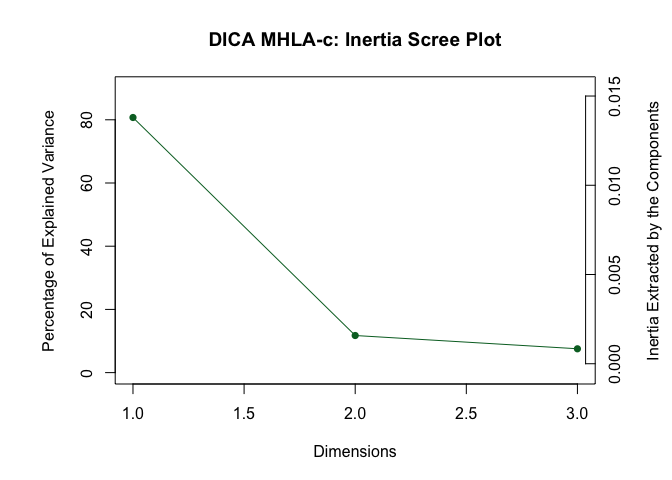<!-- -->

``` r
# Save the plot
#a0001.Scree.sv <- recordPlot()
```

``` r
#_____________________________________________________________________
# catColors ---- Age + Gender
catColors <- as.factor(design.age.gen)
catColors <- dplyr::recode(catColors, "25+.M" = '#44277b', 
                            "25+.F" = '#761266',
                            "18-24.M" = '#816eff',
                            "18-24.F" = '#c16ddd')

#_____________________________________________________________________
#  Observations and means ----
#  Observations ----
#_____________________________________________________________________
axis1 = 1
axis2 = 2
Imap.constraints  <- lapply(prettyGraphs::minmaxHelper(resDiCA$TExPosition.Data$fii[,c(axis1, axis2)]), "*", 0.9)

## Use the colors below if you want to colour by performance-levels.
perf <- read.csv(paste0(DataDir,"MHLAc_Obs4MCA.csv"), header=TRUE)
perf.groups <- as.matrix(perf[,1])

col4perf <- dplyr::recode(as.matrix(perf), "High" = 'mediumseagreen',
                            "Medium" = 'darkorange',
                            "Low" = 'red3')

Imap.perf <- PTCA4CATA::createFactorMap(
  resDiCA$TExPosition.Data$fii,
  display.labels = FALSE,
  col.points = col4perf, # use col4perf if showing performance
  col.labels = catColors,
  alpha.points = .2,
  cex = 1.5,
  constraints = Imap.constraints,
  col.axes = "orchid4", alpha.axes = 0.5,
  col.background = adjustcolor("lavender", alpha.f = 0)
)


Imap <- PTCA4CATA::createFactorMap(
  resDiCA$TExPosition.Data$fii,
  display.labels = FALSE,
  col.points = catColors, # use col4perf if showing performance
  col.labels = catColors,
  alpha.points = .2,
  cex = 1.5,
  constraints = Imap.constraints,
  col.axes = "orchid4", alpha.axes = 0.5,
  col.background = adjustcolor("lavender", alpha.f = 0)
)

#_____________________________________________________________________
# make labels ----
label4Map <- createxyLabels.gen(1,2,
                                lambda = resDiCA$TExPosition.Data$eigs,
                                tau = resDiCA$TExPosition.Data$t)
#______________________________________________________________
# ** Fix Fi means ** ----
factor.choose <- descriptors$AgeGen

# a vector of color for the means
# Explicit recoding to make sure that the names match

catMeans <- PTCA4CATA::getMeans(resDiCA$TExPosition.Data$fii, 
                                 factor = factor.choose)

# a vector of color for the means
# Explicit recoding to make sure that the names match
col4Means <- recode(rownames(catMeans), "25+.M" = '#44277b', 
                    "25+.F" = '#761266',
                    "18-24.M" = '#816eff',
                    "18-24.F" = '#c16ddd')
# The map ----
MapGroup <- PTCA4CATA::createFactorMap(catMeans, axis1 = 1, axis2 = 2,
                               # use the constraints from the main map
                              constraints = Imap$constraints,
                              #centers = resDiCA$TExPosition.Data$fi,
                              col.points = col4Means,
                              cex = 6,  # size of the dot (bigger)
                              col.labels = col4Means,
                              text.cex = 6, alpha.points = 0.75,
                              col.axes = "orchid4", alpha.axes = 0.5,
                              col.background = adjustcolor("lavender", alpha.f = 0))

# The map with observations and group means
options(ggrepel.max.overlaps = Inf)
a002a.DICA <- Imap$zeMap + label4Map +
  MapGroup$zeMap_dots + MapGroup$zeMap_text +
  theme(axis.title = element_text(size=16), axis.text.x = element_text(size=16), axis.text.y = element_text(size = 16))
# dev.new()
print(a002a.DICA)
```

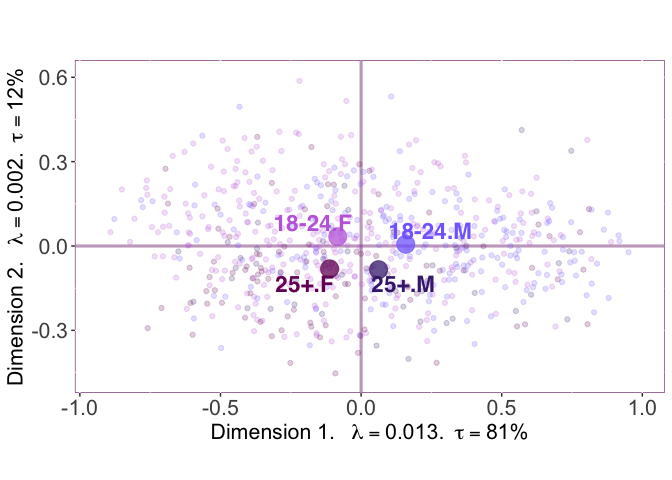<!-- -->

``` r
# The map with observations and group means with performance colors
a002aa.DICA <- Imap.perf$zeMap + label4Map +
  MapGroup$zeMap_dots + MapGroup$zeMap_text +
  theme(axis.title = element_text(size=16), axis.text.x = element_text(size=16), axis.text.y = element_text(size = 16))
# dev.new()
print(a002aa.DICA)
```

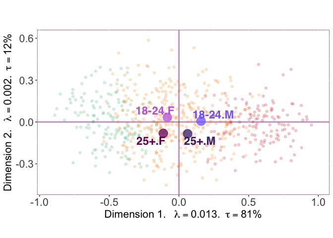<!-- -->

``` r
#_____________________________________________________________________
# Confidence intervals
# Bootstrapped CI ----
#_____________________________________________________________________
# Create Confidence Interval Plots
# use function MakeCIEllipses from package PTCA4CATA
# First get the order of colors for the ellipses
truc <- unique(rownames(resDiCA.inf$Inference.Data$boot.data$fi.boot.data$boots))
truc <- sub(".","",truc)
truc <- match(truc,rownames(catMeans))

col4Means.ordered <- col4Means[(truc)]

# The map
GraphElli <- PTCA4CATA::MakeCIEllipses(
  resDiCA.inf$Inference.Data$boot.data$fi.boot.data$boots[,1:2,],
  col = col4Means.ordered, 
  alpha.ellipse = 0.1,
  #centers = resDiCA$TExPosition.Data$fi,
  p.level = .95
)

#_____________________________________________________________________
# The map with Observations, means and confidence intervals
#_____________________________________________________________________

a002b.DICA.withCI <-  Imap$zeMap_background + Imap$zeMap_dots +
  MapGroup$zeMap_dots + MapGroup$zeMap_text +
  GraphElli + label4Map +
  ggtitle('DICA: Group Centers with CI and Observations') +
  theme(axis.title = element_text(size=16), axis.text.x = element_text(size=16), axis.text.y = element_text(size = 16))
# dev.new()
print(a002b.DICA.withCI)
```

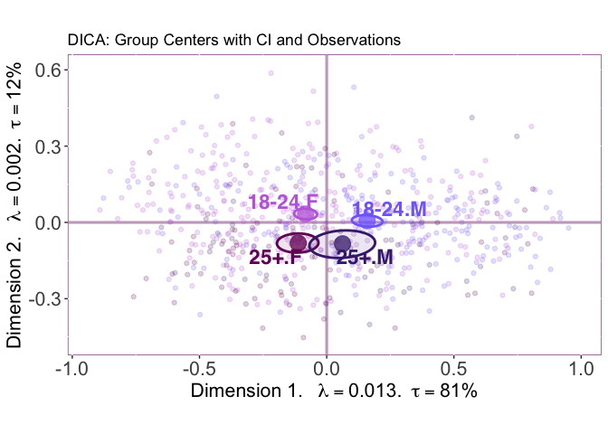<!-- -->

``` r
# The map with hull ----
Fii <- resDiCA$TExPosition.Data$fii
Fii.loo <-resDiCA.inf$Inference.Data$loo.data$loo.fii
design.hull <- descriptors$AgeGen

# Use function MakeToleranceIntervals from package PTCA4CATA
colnames(Fii) <- paste0('D', 1:ncol(Fii))
Tol.GraphHull <- PTCA4CATA::MakeToleranceIntervals(Fii,
                                               design = design.hull,
                                               col = col4Means,
                                               type = 'hull',
                                               alpha.ellipse = 0.05,
                                               alpha.line = 0.5,
                                               line.size = .75,
                                               p.level = 1.0)

Pred.GraphHull <- PTCA4CATA::MakeToleranceIntervals(Fii.loo,
                                                   design = design.hull,
                                                   col = col4Means,
                                                   type = 'hull',
                                                   alpha.ellipse = 0.05,
                                                   alpha.line = 0.5,
                                                   line.size = .75,
                                                   p.level = 1.0)

# Fixed effects
a002c.DICA.withTolHull <-  Imap$zeMap_background + Imap$zeMap_dots + 
  Tol.GraphHull + label4Map +
  MapGroup$zeMap_dots + MapGroup$zeMap_text +
  ggtitle('DICA: Group Centers with Tolerance Hulls and Observations') +
  theme(axis.title = element_text(size=16), axis.text.x = element_text(size=16), axis.text.y = element_text(size = 16))
#  dev.new()
  print(a002c.DICA.withTolHull )
```

<!-- -->

``` r
# Random effects
a002d.DICA.withPredHull <-  Imap$zeMap_background + Imap$zeMap_dots + 
  Pred.GraphHull + label4Map +
  MapGroup$zeMap_dots + MapGroup$zeMap_text +
  ggtitle('DICA: Group Centers with Prediction Hulls and Observations') +
  theme(axis.title = element_text(size=16), axis.text.x = element_text(size=16), axis.text.y = element_text(size = 16))
#  dev.new()
  print(a002d.DICA.withPredHull )
```

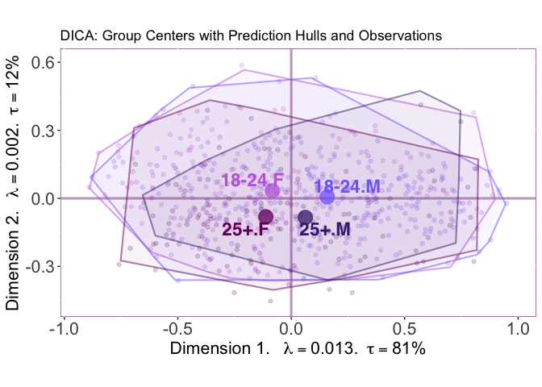<!-- -->

``` r
#_____________________________________________________________________
## The map with observations, group means and supplementary projections

age.sup <- Boot4Mean(resDiCA$TExPosition.Data$fii, design = design.age, niter = 1000, suppressProgressBar = TRUE)

age.more.sup <- Boot4Mean(resDiCA$TExPosition.Data$fii, design = design.age.sup, niter = 1000, suppressProgressBar = TRUE)

age.gen.more.sup <- Boot4Mean(resDiCA$TExPosition.Data$fii, design = design.age.gen.sup, niter = 1000, suppressProgressBar = TRUE)

gen.sup <- Boot4Mean(resDiCA$TExPosition.Data$fii, design = design.gender, niter = 1000, suppressProgressBar = TRUE)

clin.sup <- Boot4Mean(resDiCA$TExPosition.Data$fii, design = design.clin, niter = 1000, suppressProgressBar = TRUE)

interaction.sup <- Boot4Mean(resDiCA$TExPosition.Data$fii, design = design.age.gen, niter = 1000, suppressProgressBar = TRUE)
```

``` r
# Age as supp
col4Means.age <- recode(rownames(age.sup$GroupMeans),
                        "18-24" = '#e1037f',
                        "25+" = '#7333ca')

supMap.age <- PTCA4CATA::createFactorMap(age.sup$GroupMeans, axis1 = 1, axis2 = 2,
                                         # use the constraints from the main map
                                         constraints = Imap$constraints,
                                         #centers = resDiCA$TExPosition.Data$fi,
                                         col.points = col4Means.age,
                                         cex = 3,  # size of the dot (bigger)
                                         col.labels = col4Means.age,
                                         col.axes = "orchid4", alpha.axes = 0.5,
                                         col.background = adjustcolor("lavender", alpha.f = 0),
                                         text.cex = 5, alpha.points = 0.75)
a003a.DICA.sup.age <- Imap$zeMap + label4Map +
  supMap.age$zeMap_dots + supMap.age$zeMap_text +
  theme(axis.title = element_text(size=16), axis.text.x = element_text(size=16), axis.text.y = element_text(size = 16))

# Make CIs
GraphElli.age <- PTCA4CATA::MakeCIEllipses(
  age.sup$BootCube[,1:2,],
  col = col4Means.age,
  alpha.ellipse = 0.1,
  line.size = 0.5,
  #centers = resDiCA$TExPosition.Data$fi,
  p.level = .95)

a003aa.DICA.sup.age.CI <- Imap$zeMap + label4Map +
  GraphElli.age + supMap.age$zeMap_dots + supMap.age$zeMap_text + 
  theme(axis.title = element_text(size=16), axis.text.x = element_text(size=16), axis.text.y = element_text(size = 16))
# dev.new()
print(a003aa.DICA.sup.age.CI)
```

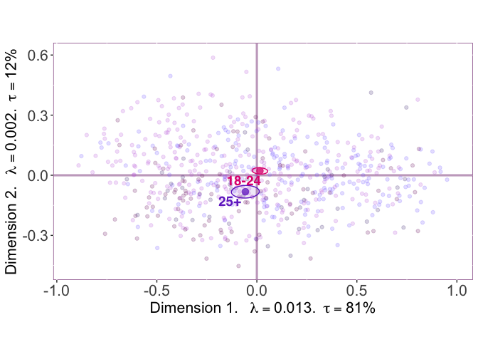<!-- -->

``` r
## Gender as supp
col4Means.gen <- recode(rownames(gen.sup$GroupMeans),
                        "Female" = '#fc83cb',
                        "Male" = '#4b98f9')

supMap.gen <- PTCA4CATA::createFactorMap(gen.sup$GroupMeans, axis1 = 1, axis2 = 2,
                                         # use the constraints from the main map
                                         constraints = Imap$constraints,
                                         #centers = resDiCA$TExPosition.Data$fi,
                                         col.points = col4Means.gen,
                                         cex = 3,  # size of the dot (bigger)
                                         col.labels = col4Means.gen,
                                         col.axes = "orchid4", alpha.axes = 0.5,
                                         col.background = adjustcolor("lavender", alpha.f = 0),
                                         text.cex = 5, alpha.points = 0.75)
# The map with supp and group means
a003b.DICA.sup.gen <- Imap$zeMap + label4Map +
  supMap.gen$zeMap_dots + supMap.gen$zeMap_text+
  theme(axis.title = element_text(size=16), axis.text.x = element_text(size=16), axis.text.y = element_text(size = 16))

# Make CIs
GraphElli.gen <- PTCA4CATA::MakeCIEllipses(
  gen.sup$BootCube[,1:2,],
  col = col4Means.gen,
  alpha.ellipse = 0.1,
  line.size = 0.5,
  #centers = resDiCA$TExPosition.Data$fi,
  p.level = .95)

a003bb.DICA.sup.gen.CI <- Imap$zeMap + label4Map +
  GraphElli.gen + supMap.gen$zeMap_dots + supMap.gen$zeMap_text +
  theme(axis.title = element_text(size=16), axis.text.x = element_text(size=16), axis.text.y = element_text(size = 16))
# dev.new()
print(a003bb.DICA.sup.gen.CI)
```

<!-- -->

``` r
## Age and gender main effects as supp
a003bbb.DICA.sup.age.gen <- Imap$zeMap + label4Map +
  supMap.age$zeMap_dots + supMap.age$zeMap_text + GraphElli.age +
  supMap.gen$zeMap_dots + supMap.gen$zeMap_text + GraphElli.gen +
  theme(axis.title = element_text(size=16), axis.text.x = element_text(size=16), axis.text.y = element_text(size = 16))
# dev.new()
print(a003bbb.DICA.sup.age.gen)
```

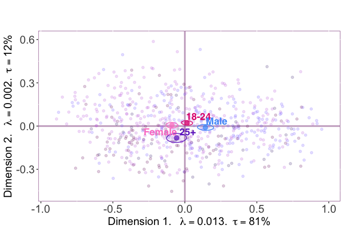<!-- -->

``` r
## Age and gender interaction
col4Means.sup.interaction <- recode(rownames(interaction.sup$GroupMeans),
                                    "25+.M" = '#44277b', 
                                    "25+.F" = '#761266',
                                    "18-24.M" = '#816eff',
                                    "18-24.F" = '#c16ddd')

supMap.interaction <- PTCA4CATA::createFactorMap(interaction.sup$GroupMeans, axis1 = 1, axis2 = 2,
                                                 # use the constraints from the main map
                                                 constraints = Imap$constraints,
                                                 #centers = resDiCA$TExPosition.Data$fi,
                                                 col.points = col4Means.sup.interaction,
                                                 cex = 3,  # size of the dot (bigger)
                                                 col.labels = col4Means.sup.interaction,col.axes = "orchid4", alpha.axes = 0.5,
                                                 col.background = adjustcolor("lavender", alpha.f = 0),
                                                 text.cex = 5, alpha.points = 0.75)

a003bbbb.DICA.sup.interaction <- Imap$zeMap + label4Map +
  supMap.interaction$zeMap_dots + supMap.interaction$zeMap_text +
  theme(axis.title = element_text(size=16), axis.text.x = element_text(size=16), axis.text.y = element_text(size = 16))

# Add lines to interaction effect
DICA.line.sup.F <- data.frame(cbind(interaction.sup$GroupMeans[c(1,3),1:2]))
colnames(DICA.line.sup.F) <- cbind('Dimension 1', 'Dimension 2')
DICA.line.sup.M <- data.frame(cbind(interaction.sup$GroupMeans[c(2,4),1:2]))
colnames(DICA.line.sup.M) <- cbind('Dimension 1', 'Dimension 2')
a003bbbbb.DICA.interaction.lines <- Imap$zeMap + label4Map +
  supMap.interaction$zeMap_dots + supMap.interaction$zeMap_text +
  geom_path(data = DICA.line.sup.F, color = '#fc83cb', size = 2, lineend = "round", linejoin = "round", alpha = 0.5) +
  geom_path(data = DICA.line.sup.M, color = '#4b98f9', size = 2, lineend = "round", linejoin = "round", alpha = 0.5) +
  theme(axis.title = element_text(size=16), axis.text.x = element_text(size=16), axis.text.y = element_text(size = 16))
# dev.new()
print(a003bbbbb.DICA.interaction.lines)
```

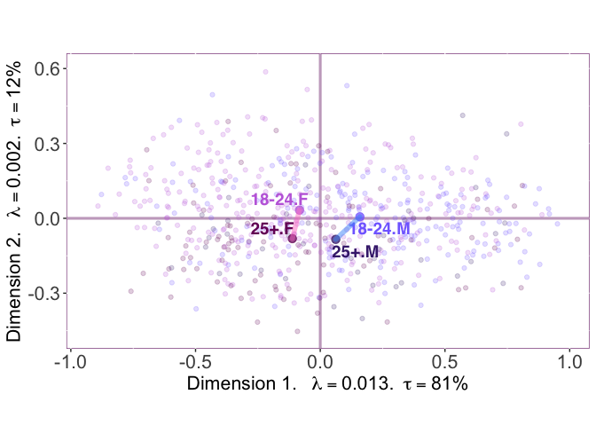<!-- -->

``` r
# Make CIs
GraphElli.interaction <- PTCA4CATA::MakeCIEllipses(
  interaction.sup$BootCube[,1:2,],
  col = col4Means.sup.interaction,
  alpha.ellipse = 0.1,
  line.size = 0.5,
  #centers = resDiCA$TExPosition.Data$fi,
  p.level = .95)

a003bbbbbb.DICA.sup.interaction.CI <- Imap$zeMap + label4Map +
  GraphElli.interaction + supMap.interaction$zeMap_dots + supMap.interaction$zeMap_text + 
  theme(axis.title = element_text(size=16), axis.text.x = element_text(size=16), axis.text.y = element_text(size = 16))
# dev.new()
print(a003bbbbbb.DICA.sup.interaction.CI)
```

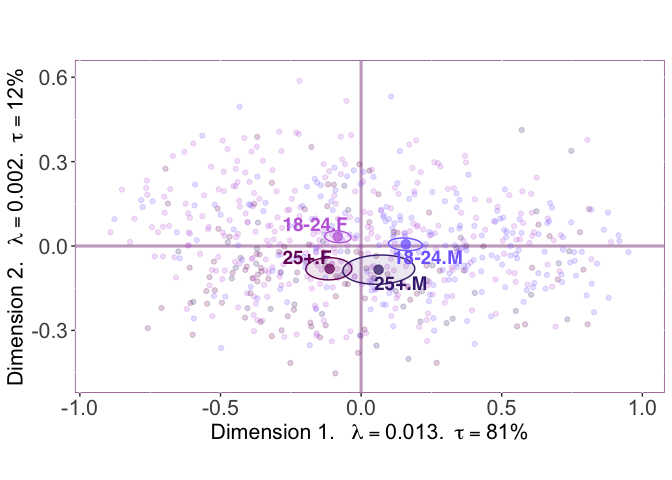<!-- -->

``` r
# Map with main effects and interaction
a003bbbbbbb.DICA.sup.main.effects.interaction.CI <- Imap$zeMap + label4Map +
  supMap.gen$zeMap_dots + supMap.gen$zeMap_text + GraphElli.gen +
  supMap.age$zeMap_dots + supMap.age$zeMap_text + GraphElli.age +
  supMap.interaction$zeMap_dots + supMap.interaction$zeMap_text + GraphElli.interaction +
  theme(axis.title = element_text(size=16), axis.text.x = element_text(size=16), axis.text.y = element_text(size = 16))
# dev.new()
print(a003bbbbbbb.DICA.sup.main.effects.interaction.CI)
```

<!-- -->

``` r
## More age-groups as supp
col4Means.age.more <- recode(rownames(age.more.sup$GroupMeans),
                             "18-20" = '#e1037f',
                             "21-24" = '#e1037f',
                             "25-29" = '#7333ca',
                             "30+" = '#7333ca')

supMap.age.more <- PTCA4CATA::createFactorMap(age.more.sup$GroupMeans, axis1 = 1, axis2 = 2,
                                              # use the constraints from the main map
                                              constraints = Imap$constraints,
                                              #centers = resDiCA$TExPosition.Data$fi,
                                              col.points = col4Means.age.more,
                                              cex = 3,  # size of the dot (bigger)
                                              col.labels = col4Means.age.more,
                                              col.axes = "orchid4", alpha.axes = 0.5,
                                              col.background = adjustcolor("lavender", alpha.f = 0),
                                              text.cex = 5, alpha.points = 0.75)

# The map with supp and group means
a003c.DICA.sup.age.more <- Imap$zeMap + label4Map +
  supMap.age.more$zeMap_dots + supMap.age.more$zeMap_text +
  theme(axis.title = element_text(size=16), axis.text.x = element_text(size=16), axis.text.y = element_text(size = 16))

# Make CIs
GraphElli.age.more <- PTCA4CATA::MakeCIEllipses(
  age.more.sup$BootCube[,1:2,],
  alpha.ellipse = 0.1,
  line.size = 0.5,
  col = col4Means.age.more, 
  #centers = resDiCA$TExPosition.Data$fi,
  p.level = .95)

a003cc.DICA.sup.age.more.CI <- Imap$zeMap + label4Map +
  GraphElli.age.more + supMap.age.more$zeMap_dots + supMap.age.more$zeMap_text +
  theme(axis.title = element_text(size=16), axis.text.x = element_text(size=16), axis.text.y = element_text(size = 16)) 
# dev.new()
print(a003cc.DICA.sup.age.more.CI)
```

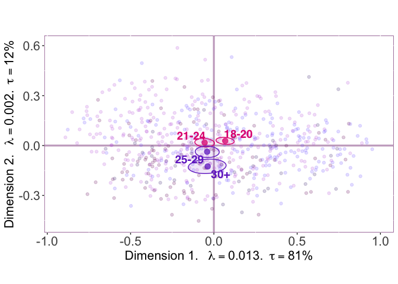<!-- -->

``` r
## More age-groups and gender as supp
col4Means.age.gen.more <- recode(rownames(age.gen.more.sup$GroupMeans),
                             "18-20.F" = '#fc83cb',
                             "21-24.F" = '#fc83cb',
                             "25-29.F" = '#fc83cb',
                             "30+.F" = '#fc83cb',
                             "18-20.M" = '#4b98f9',
                             "21-24.M" = '#4b98f9',
                             "25-29.M" = '#4b98f9',
                             "30+.M" = '#4b98f9')

supMap.age.gen.more <- PTCA4CATA::createFactorMap(age.gen.more.sup$GroupMeans, axis1 = 1, axis2 = 2,
                                              # use the constraints from the main map
                                              constraints = Imap$constraints,
                                              #centers = resDiCA$TExPosition.Data$fi,
                                              col.points = col4Means.age.gen.more,
                                              cex = 3,  # size of the dot (bigger)
                                              col.labels = col4Means.age.gen.more,
                                              col.axes = "orchid4", alpha.axes = 0.5,
                                              col.background = adjustcolor("lavender", alpha.f = 0),
                                              text.cex = 5, alpha.points = 0.75)
# The map with supp and group means
a003d.DICA.sup.age.gen.more <- Imap$zeMap + label4Map +
  supMap.age.gen.more$zeMap_dots + supMap.age.gen.more$zeMap_text +
  theme(axis.title = element_text(size=16), axis.text.x = element_text(size=16), axis.text.y = element_text(size = 16))
#print(a003d.DICA.sup.age.gen.more)

# Make CIs
GraphElli.age.gen.more <- PTCA4CATA::MakeCIEllipses(
  age.gen.more.sup$BootCube[,1:2,],
  col = col4Means.age.gen.more,
  alpha.ellipse = 0.1,
  line.size = 0.5,
  #centers = resDiCA$TExPosition.Data$fi,
  p.level = .95)

# Make a line to join the points
DICA.line.sup.F <- data.frame(cbind(age.gen.more.sup$GroupMeans[c(1,3,5,7),1:2]))
colnames(DICA.line.sup.F) <- cbind('Dimension 1', 'Dimension 2')
DICA.line.sup.M <- data.frame(cbind(age.gen.more.sup$GroupMeans[c(2,4,6,8),1:2]))
colnames(DICA.line.sup.M) <- cbind('Dimension 1', 'Dimension 2')
a003ddd.DICA.sup.age.gen.more.lines <- Imap$zeMap + label4Map +
  geom_path(data = DICA.line.sup.F, color = '#fc83cb', size = 2, lineend = "round", linejoin = "round", alpha = 0.5) +
  geom_path(data = DICA.line.sup.M, color = '#4b98f9', size = 2, lineend = "round", linejoin = "round", alpha = 0.5) +
  supMap.age.gen.more$zeMap_dots + supMap.age.gen.more$zeMap_text +
  theme(axis.title = element_text(size=16), axis.text.x = element_text(size=16), axis.text.y = element_text(size = 16))
# dev.new()
print(a003ddd.DICA.sup.age.gen.more.lines)
```

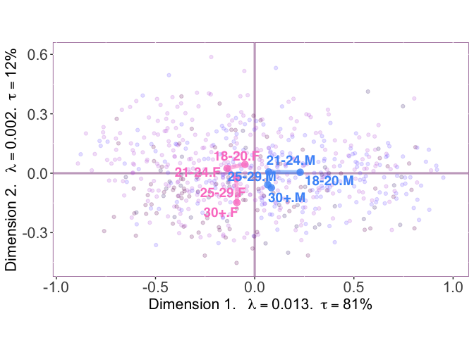<!-- -->

``` r
a003dd.DICA.sup.age.gen.more.CI <- Imap$zeMap + label4Map +
  GraphElli.age.gen.more + supMap.age.gen.more$zeMap_dots + supMap.age.gen.more$zeMap_text +
  geom_path(data = DICA.line.sup.F, color = 'hotpink3', size = 2, lineend = "round", linejoin = "round", alpha = 0.8) +
  geom_path(data = DICA.line.sup.M, color = 'royalblue3', size = 2, lineend = "round", linejoin = "round", alpha = 0.8) +
  theme(axis.title = element_text(size=16), axis.text.x = element_text(size=16), axis.text.y = element_text(size = 16))
# dev.new()
print(a003dd.DICA.sup.age.gen.more.CI)
```

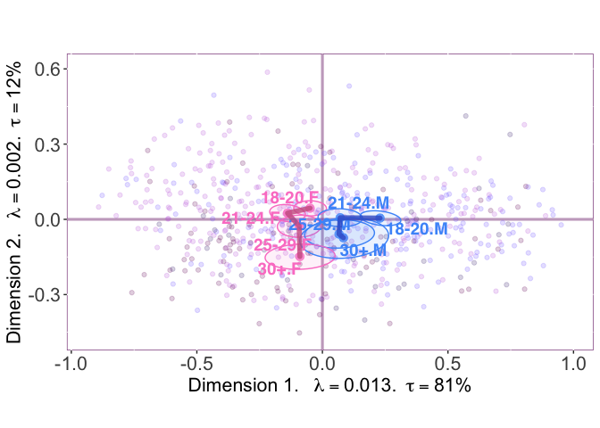<!-- -->

``` r
## Clinical course as supp

col4Means.clin <- recode(rownames(clin.sup$GroupMeans),
                                    "Clin" = '#cacc5e',
                                  "NoClin" = '#76703c')

supMap.clin <- PTCA4CATA::createFactorMap(clin.sup$GroupMeans, axis1 = 1, axis2 = 2,
                                          # use the constraints from the main map
                                          constraints = Imap$constraints,
                                          #centers = resDiCA$TExPosition.Data$fi,
                                          col.points = col4Means.clin,
                                          cex = 3,  # size of the dot (bigger)
                                          col.labels = col4Means.clin,
                                          col.axes = "orchid4", alpha.axes = 0.5,
                                          col.background = adjustcolor("lavender", alpha.f = 0),
                                          text.cex = 5, alpha.points = 0.75)

a003f.DICA.sup.clin <- Imap$zeMap + label4Map +
  supMap.clin$zeMap_dots + supMap.clin$zeMap_text

# Make CIs
GraphElli.clin <- PTCA4CATA::MakeCIEllipses(
  clin.sup$BootCube[,1:2,],
  col = col4Means.clin,
  alpha.ellipse = 0.1,
  line.size = 0.5,
  #centers = resDiCA$TExPosition.Data$fi,
  p.level = .95)

a003ff.DICA.sup.clin.CI <- Imap$zeMap + label4Map +
  GraphElli.clin + supMap.clin$zeMap_dots + supMap.clin$zeMap_text + 
  theme(axis.title = element_text(size=16), axis.text.x = element_text(size=16), axis.text.y = element_text(size = 16))
# dev.new()
print(a003ff.DICA.sup.clin.CI)
```

<!-- -->

``` r
#_____________________________________________________________________
# J-set ----
# get colors

# Order the columns based on colnames (i.e., in pairs of 0 = wrong, 1 = right)
data.col.order <- c(order(rownames(resDiCA$TExPosition.Data$cj[1:8,])),
                    order(rownames(resDiCA$TExPosition.Data$cj[9:18,]))+8,
                    order(rownames(resDiCA$TExPosition.Data$cj[19:35,]))+18,
                    order(rownames(resDiCA$TExPosition.Data$cj[36:66,]))+35)

nominalcolnames <- colnames(resDiCA$TExPosition.Data$X)
nominalcolnames <- nominalcolnames[,data.col.order]
nominalcolnames <- gsub("\\.[R,W]", "",
                          drop(colnames(resDiCA$TExPosition.Data$X)))

# Use the code below if your data are coded as 0 and 1
# nominalcolnames <- gsub("\\.[0-1]", "",
#                         drop(colnames(resDiCA$TExPosition.Data$X)))

col.symp <- colorRampPalette(c("#3f0000", "#8d0000", "#fa674a", "#ffcac5"))
col.sym.list <- col.symp(16)
col.gen <- colorRampPalette(c("#104b0d", "#2e8537", "#aae6ba"))
col.gen.list <- col.gen(8)
col.treat <- colorRampPalette(c("#ff9000", "#ffdb57", "#fbf06a"))
col.treat.list <- col.treat(5)
col.etio <- colorRampPalette(c("#00344d", "#004c7d", "#92c4db"))
col.etio.list <- col.etio(4)

groups.33 <- filter(groups.norm, !grepl(".R",groups.norm$GroupNorm))
groups.33 <-  sub(".W", "", groups.33$GroupNorm)
groups.33[groups.33=="Symptoms"] <- col.sym.list
groups.33[groups.33=="General"] <- col.gen.list
groups.33[groups.33=="Treatment"] <- col.treat.list
groups.33[groups.33=="Etiology"] <- col.etio.list

col4Var <- groups.33
col4VarNom <- rep(groups.33,foo(nominalcolnames))

# col4Var <- prettyGraphsColorSelection(n.colors = ncol(XYmat)/2,offset = 17,
#                                       starting.color = 44)
# col4VarNom <- rep(col4Var,foo(nominalcolnames))

#_____________________________________________________________________
Fj <- resDiCA$TExPosition.Data$fj
baseMap.j <- PTCA4CATA::createFactorMap(Fj,
                                        display.labels = TRUE,
                                        col.points   = col4VarNom,
                                        alpha.points =  .3,
                                        text.cex = 2.5,
                                        col.axes = "orchid4", alpha.axes = 0.5,
                                        col.background = adjustcolor("lavender", alpha.f = 0),
                                        col.labels   = col4VarNom)
#_____________________________________________________________________
b001.BaseMap.Fj <- baseMap.j$zeMap + label4Map 
# add Lines ----
lines4J <- addLines4MCA(Fj, col4Var = col4Var)
b003.MapJ.text <-  b001.BaseMap.Fj + lines4J +
  theme(axis.title = element_text(size=16), axis.text.x = element_text(size=16), axis.text.y = element_text(size = 16))
# dev.new()
print(b003.MapJ.text)
```

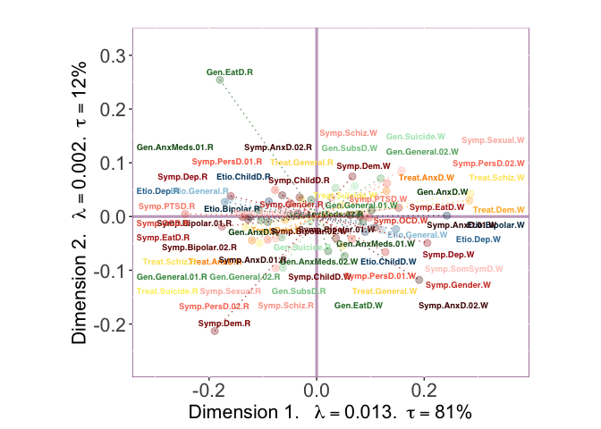<!-- -->

``` r
#_____________________________________________________________________
# Create Factor map per block

Fj.constraints  <- lapply(prettyGraphs::minmaxHelper(Fj[,c(axis1, axis2)]), "*", 0.9)

Fj.etio <-Fj[groups.norm$Classification=='Etiology',]
col4etio <- col4VarNom[groups.norm$Classification=='Etiology']
baseMap.j.etio <- PTCA4CATA::createFactorMap(Fj.etio,
                                        display.labels = TRUE,
                                        col.points   = col4etio,
                                        alpha.points =  .3,
                                        text.cex = 4,
                                        constraints = Fj.constraints,
                                        col.axes = "orchid4", alpha.axes = 0.5,
                                        col.background = adjustcolor("lavender", alpha.f = 0),
                                        col.labels   = col4etio)
b001.BaseMap.Fj.etio <- baseMap.j.etio$zeMap + label4Map 

# Add Lines ----
lines4J.etio <- addLines4MCA(Fj.etio, col4Var = col.etio.list)
b003a.MapJ.text.etio <-  b001.BaseMap.Fj.etio + lines4J.etio +
  theme(axis.title = element_text(size=16), axis.text.x = element_text(size=16), axis.text.y = element_text(size = 16))
# dev.new()
print(b003a.MapJ.text.etio)
```

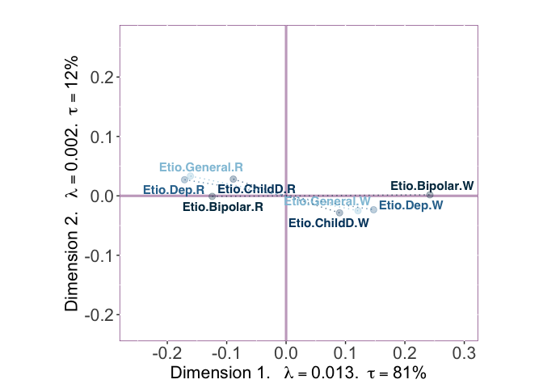<!-- -->

``` r
Fj.symp <-Fj[groups.norm$Classification=='Symptoms',]
col4symp <- col4VarNom[groups.norm$Classification=='Symptoms']
baseMap.j.symp <- PTCA4CATA::createFactorMap(Fj.symp,
                                             display.labels = TRUE,
                                             col.points   = col4symp,
                                             alpha.points =  .3,
                                             text.cex = 4,
                                             constraints = Fj.constraints,
                                             col.axes = "orchid4", alpha.axes = 0.5,
                                             col.background = adjustcolor("lavender", alpha.f = 0),
                                             col.labels   = col4symp)
b001.BaseMap.Fj.symp <- baseMap.j.symp$zeMap + label4Map 

# Add Lines ----
lines4J.symp <- addLines4MCA(Fj.symp, col4Var = col.sym.list)
b003b.MapJ.text.symp <-  b001.BaseMap.Fj.symp + lines4J.symp +
  theme(axis.title = element_text(size=16), axis.text.x = element_text(size=16), axis.text.y = element_text(size = 16))
# dev.new()
print(b003b.MapJ.text.symp)
```

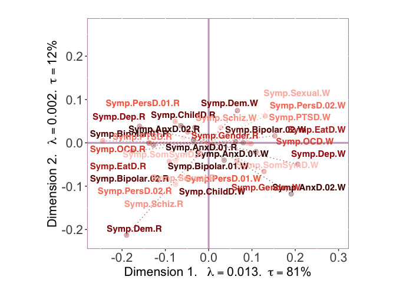<!-- -->

``` r
Fj.treat <-Fj[groups.norm$Classification=='Treatment',]
col4treat <- col4VarNom[groups.norm$Classification=='Treatment']
baseMap.j.treat <- PTCA4CATA::createFactorMap(Fj.treat,
                                             display.labels = TRUE,
                                             col.points   = col4treat,
                                             alpha.points =  .3,
                                             text.cex = 4,
                                             constraints = Fj.constraints,
                                             col.axes = "orchid4", alpha.axes = 0.5,
                                             col.background = adjustcolor("lavender", alpha.f = 0),
                                             col.labels   = col4treat)
b001.BaseMap.Fj.treat <- baseMap.j.treat$zeMap + label4Map 

# Add Lines ----
lines4J.treat <- addLines4MCA(Fj.treat, col4Var = col.treat.list)
b003c.MapJ.text.treat <-  b001.BaseMap.Fj.treat + lines4J.treat +
  theme(axis.title = element_text(size=16), axis.text.x = element_text(size=16), axis.text.y = element_text(size = 16))
# dev.new()
print(b003c.MapJ.text.treat)
```

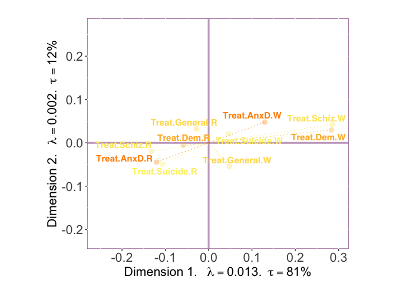<!-- -->

``` r
Fj.gen <-Fj[groups.norm$Classification=='General',]
col4gen <- col4VarNom[groups.norm$Classification=='General']
baseMap.j.gen <- PTCA4CATA::createFactorMap(Fj.gen,
                                              display.labels = TRUE,
                                              col.points   = col4gen,
                                              alpha.points =  .3,
                                              text.cex = 4,
                                              constraints = Fj.constraints,
                                              col.axes = "orchid4", alpha.axes = 0.5,
                                              col.background = adjustcolor("lavender", alpha.f = 0),
                                              col.labels   = col4gen)
b001.BaseMap.Fj.gen <- baseMap.j.gen$zeMap + label4Map 

# Add Lines ----
lines4J.gen <- addLines4MCA(Fj.gen, col4Var = col.gen.list)
b003d.MapJ.text.gen <-  b001.BaseMap.Fj.gen + lines4J.gen +
  theme(axis.title = element_text(size=16), axis.text.x = element_text(size=16), axis.text.y = element_text(size = 16))
# dev.new()
print(b003d.MapJ.text.gen)
```

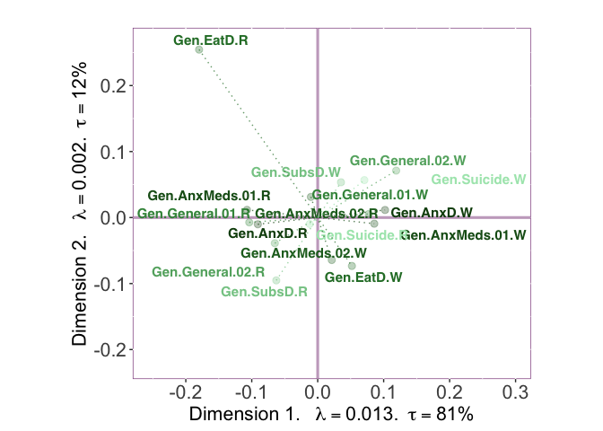<!-- -->

``` r
#_____________________________________________________________________
##  Contributions ---- USE BLOCK COLORS
#_____________________________________________________________________
#_____________________________________________________________________
# Ctr J-set ----
# 
ctrj <- resDiCA$TExPosition.Data$cj
signed.ctrj <- ctrj * sign(Fj)
bootratio.1 <- round(100*signed.ctrj[,1])
###### CtrJ 1 ----
c001.plotCtrj.1 <- PrettyBarPlot2(
  bootratio.1[data.col.order], 
  font.size = 3.5,
  threshold = 100 / nrow(signed.ctrj), 
  ylim = c(-10,25), 
  #color4bar = gplots::col2hex(col4VarNom), # If NO SORT
  color4bar = gplots::col2hex(col4VarNom[data.col.order]), # IF SORT
  color4ns = "gray75", 
  plotnames = TRUE, 
  #sortValues = TRUE,
  #horizontal = TRUE,
  main = 'Important Contributions Variables. Dim 1.', 
  ylab = "Signed Contributions")
c001.plotCtrj.1.all <-  c001.plotCtrj.1 +
  theme(axis.title = element_text(size=16), axis.text.y = element_text(size = 16))
# dev.new()
print(c001.plotCtrj.1.all)
```

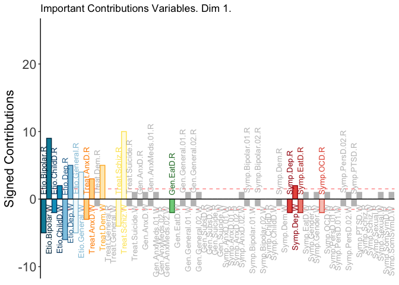<!-- -->

``` r
#_____________________________________________________________________
###### CtrJ 2 ====
# 
bootratio.2 <- round(100*signed.ctrj[,2])
c002.plotCtrj.2 <- PrettyBarPlot2(
  bootratio.2[data.col.order], 
  font.size = 3.5,
  threshold = 100 / nrow(signed.ctrj), 
  ylim = c(-10,25), 
  #color4bar = gplots::col2hex(col4VarNom), # If NO SORT
  color4bar = gplots::col2hex(col4VarNom[data.col.order]), # If NO SORT
  color4ns = "gray75", 
  plotnames = TRUE, 
  #sortValues = TRUE,
  main = 'Important Contributions Variables. Dim 2.', 
  ylab = "Signed Contributions")
c002.plotCtrj.2.all <-  c002.plotCtrj.2 +
  theme(axis.title = element_text(size=16), axis.text.y = element_text(size = 16))
# dev.new()
print(c002.plotCtrj.2.all)
```

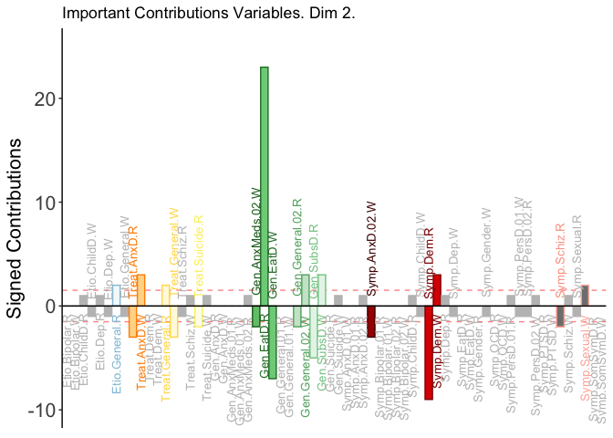<!-- -->

``` r
#_____________________________________________________________________
# Contribution Maps ---- USE BLOCK COLORS

color4Blocks.4 <- c("#8d0000", "#2e8537", "#ff9000", "#004c7d")
groupColors.33 <- filter(groups.norm, !grepl(".R",groups.norm$GroupNorm))
groupColors.33 <-  sub(".W", "", groupColors.33$GroupNorm)
groupColors <- dplyr::recode((groupColors.33), "Symptoms" = color4Blocks.4[1], 
                             "General" = color4Blocks.4[2],
                             "Treatment" = color4Blocks.4[3],
                             "Etiology" = color4Blocks.4[4])

CtrJ12 <- data4PCCAR::ctr4Variables(resDiCA$TExPosition.Data$cj)
var12 <- data4PCCAR::getImportantCtr(ctr = CtrJ12,
                                     eig = resDiCA$TExPosition.Data$eigs)
importantVar <- var12$importantCtr.1or2
col4ImportantVar <- groupColors
col4NS <- 'gray90'
col4ImportantVar[!importantVar] <- col4NS

## All Vars
baseMap.ctrj <- PTCA4CATA::createFactorMap(CtrJ12 ,
                                        col.points   = groupColors, #use col4Var to use var colors
                                        alpha.points =  .3,
                                        cex = 3,
                                        text.cex = 3,
                                        col.axes = "orchid4", alpha.axes = 0.5,
                                        col.background = adjustcolor("lavender", alpha.f = 0),
                                        col.labels   = groupColors) #use col4Var to use var colors

## Important vars
baseMap.ctrj.imp <- PTCA4CATA::createFactorMap(X = CtrJ12,
                                         title = "Important Variables: Contributions",
                                         col.points = col4ImportantVar,
                                         col.labels = col4ImportantVar,
                                         alpha.points = 0.5,
                                         cex = 2.5,
                                         text.cex = 3,
                                         col.axes = "orchid4", alpha.axes = 0.5,
                                         col.background = adjustcolor("lavender", alpha.f = 0))
#_____________________________________________________________________
c003a.BaseMap.Ctrj <- baseMap.ctrj$zeMap + label4Map +
  ggtitle('Variables Contributions Map') +
  theme(axis.title = element_text(size=16), axis.text.x = element_text(size=16), axis.text.y = element_text(size = 16))
# c003.BaseMapNoDot.Ctrj  <- baseMap.ctrj$zeMap_background +
#   baseMap.ctrj$zeMap_text + label4Map 
# dev.new()
print(c003a.BaseMap.Ctrj)
```

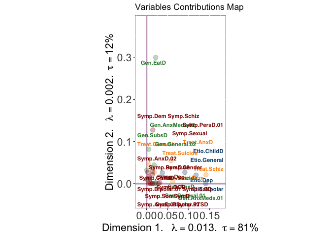<!-- -->

``` r
c003b.BaseMap.Ctrj.imp <- baseMap.ctrj.imp$zeMap + label4Map +
  ggtitle('Important Variables Contributions Map') + 
  theme(axis.title = element_text(size=16), axis.text.x = element_text(size=16), axis.text.y = element_text(size = 16))
# c003.BaseMapNoDot.Ctrj  <- baseMap.ctrj$zeMap_background +
#   baseMap.ctrj$zeMap_text + label4Map 
# dev.new()
print(c003b.BaseMap.Ctrj.imp)
```

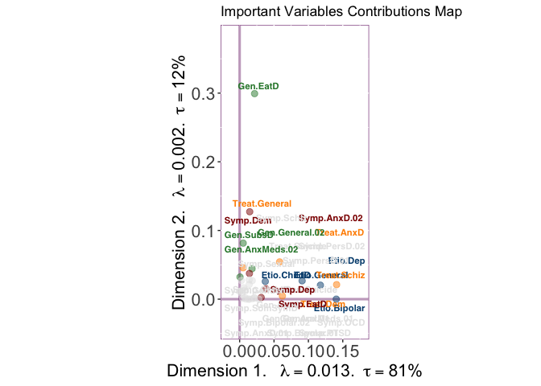<!-- -->

``` r
#_____________________________________________________________________
#  Bootstrap ratios ----
#_____________________________________________________________________
# BR4Variables ----
#_____________________________________________________________________
#BR. 1 ====
# 
BRj <- resDiCA.inf$Inference.Data$boot.data$fj.boot.data$tests$boot.ratios
dim.order <- 1
# BR1
d001.plotBRj.1 <- PrettyBarPlot2(
  bootratio = BRj[data.col.order,1],
  threshold = 2,
  ylim = c(-5,5),
  font.size = 3.5,
  color4bar = gplots::col2hex(col4VarNom[data.col.order]), #IF SORT
  #color4bar = gplots::col2hex(col4VarNom), # IF NO SORT
  color4ns = "gray75",
  #sortValues = TRUE,
  plotnames = TRUE,
  #horizontal = TRUE,
  main = 'Bootstrap Ratios Variable Levels. Dim 1.',
  ylab = "Bootstrap Ratios")
d001.plotBRj.1.all <-  d001.plotBRj.1 +
  theme(axis.title = element_text(size=16), axis.text.y = element_text(size = 16))
# dev.new()
print(d001.plotBRj.1.all)
```

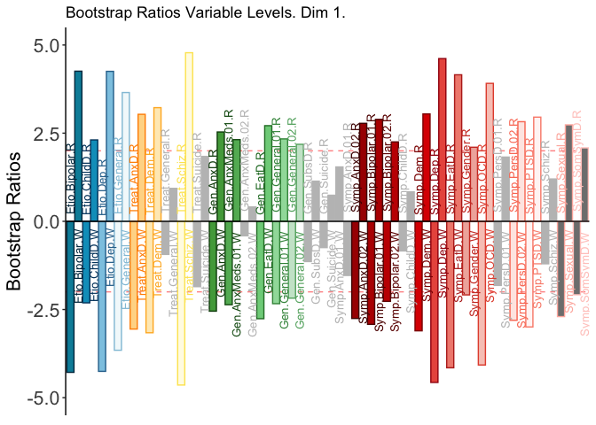<!-- -->

``` r
# #_____________________________________________________________________
# ###### BR. 2 ====
# # 
dim.order <- 2
d002.plotBRj.2 <- PrettyBarPlot2(
  bootratio = BRj[data.col.order,2],
  threshold = 2,
  font.size = 3.5,
  ylim = c(-5,5),
  color4bar = gplots::col2hex(col4VarNom[data.col.order]), #IF SORT
  #color4bar = gplots::col2hex(col4VarNom), # IF NO SORT
  color4ns = "gray75",
  #sortValues = TRUE,
  plotnames = TRUE,
  main = 'Bootstrap Ratios Variable Levels. Dim 2.',
  ylab = "Bootstrap Ratios")
d002.plotBRj.2.all <-  d002.plotBRj.2 +
  theme(axis.title = element_text(size=16), axis.text.y = element_text(size = 16))
# dev.new()
print(d002.plotBRj.2.all)
```

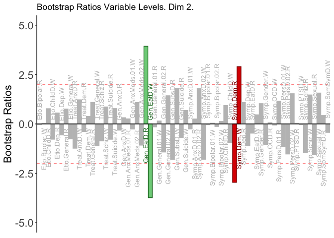<!-- -->

``` r
# #_____________________________________________________________________

## Block projections
resDiCA4Proj <- resDiCA # The code was written to handle epCA output
names(resDiCA4Proj) <- c("ExPosition.Data","Plotting.Data")
group4F <- as.factor(groups.norm$Classification)

# PartialProj4CA
tryProj <- PTCA4CATA::partialProj4CA(resDiCA4Proj,
                                     code4Blocks = group4F,
                                     rowBlocks = FALSE)

# Plotting
F.ca <- resDiCA4Proj$ExPosition.Data$fi
h_axis <- 1
v_axis <- 2
genTitle4Compromise <- "MHLAc"
color4Blocks.4corr <- c("#004c7d","#2e8537","#8d0000",  "#ff9000")


truc2 <- unique(rownames(tryProj$Fk))
truc2 <- sub(".","",truc2)
truc2 <- match(truc2,rownames(catMeans))

color4Groups <- col4Means[(truc2)]

constraints.part.proj <- minmaxHelper4Partial(F.ca, tryProj$Fk)

nDisorders    <- dim(unique(as.matrix(group4F)))[1]
nCategories   <- dim(resDiCA4Proj$ExPosition.Data$fi)[1]

gg.compromise.graph.out.ca <- PTCA4CATA::createFactorMap(F.ca,
                            axis1 = h_axis, 
                            axis2 = v_axis,
                           # use the constraints from the partial proj use constraints.part.proj
                           constraints = Imap$constraints,
                           #centers = resDiCA$TExPosition.Data$fi,
                           col.points = color4Groups,
                           cex = 4,  # size of the dot (bigger)
                           col.labels = color4Groups,
                           col.axes = "orchid4", alpha.axes = 0.5,
                           col.background = adjustcolor("lavender", alpha.f = 0),
                           text.cex = 5, alpha.points = 0.75)
```

``` r
#________________________________________________
# Partial FS ----

F_k.ca <- tryProj$Fk
colnames(F.ca) <- paste("Dimension", 1:ncol(F.ca))
colnames(F_k.ca) <- paste("Dimension", 1:ncol(F_k.ca))
map4PFS.ca <- PTCA4CATA::createPartialFactorScoresMap(
  factorScores = F.ca,
  partialFactorScores = F_k.ca,  
  axis1 = h_axis, axis2 = v_axis,
  colors4Items = as.vector(color4Groups),
  colors4Blocks = as.vector(color4Blocks.4corr),
  names4Partial = dimnames(F_k.ca)[[3]], # 
  font.labels = 'bold', 
  size.labels = 3
)
e001.partialFS.map.ca.byProducts <- 
  gg.compromise.graph.out.ca$zeMap + 
  map4PFS.ca$mapColByItems + label4Map +
  theme(axis.title = element_text(size=16), axis.text.x = element_text(size=16), axis.text.y = element_text(size = 16))
# dev.new()
print(e001.partialFS.map.ca.byProducts) 
```

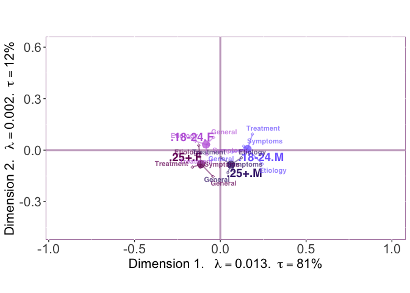<!-- -->

``` r
e002.partialFS.map.ca.byCategories  <- 
  gg.compromise.graph.out.ca$zeMap + 
  map4PFS.ca$mapColByBlocks + label4Map +
  theme(axis.title = element_text(size=16), axis.text.x = element_text(size=16), axis.text.y = element_text(size = 16))
# dev.new()
print(e002.partialFS.map.ca.byCategories)
```

<!-- -->

``` r
# Contribution Maps ----
Ctr.Blocks <- tryProj$Ctrk*tryProj$bk
block.contr.constraints <- Imap$constraints
block.contr.constraints$minx <- 0
block.contr.constraints$miny <- 0
baseMap.ctrj.blocks <- PTCA4CATA::createFactorMap(Ctr.Blocks,
                                           col.points   = color4Blocks.4corr,
                                           alpha.points =  .3,
                                           #constraints = block.contr.constraints,
                                           col.axes = "orchid4", alpha.axes = 0.5,
                                           text.cex = 5, cex = 3,
                                           col.background = adjustcolor("lavender", alpha.f = 0),
                                           col.labels   = color4Blocks.4corr)
e003.BaseMap.Ctrj.blocks <- baseMap.ctrj.blocks$zeMap + label4Map +
  ggtitle('Blocks Contributions Map') +
  theme(axis.title = element_text(size=16), axis.text.x = element_text(size=16), axis.text.y = element_text(size = 16))
# dev.new()
print(e003.BaseMap.Ctrj.blocks)
```

<!-- -->

``` r
#### Save PowerPoint
# Automatic save with saveGraph2pptx
savedList <- PTCA4CATA::saveGraph2pptx(file2Save.pptx = path2save, 
                                       title = leTitre, 
                                       addGraphNames = TRUE)
```

    ## Warning: File: ../results/GenAge-Block-DiCA.pptx already exists.
    ##  Oldfile has been renamed: ../results/GenAge-Block-DiCA-2021-10-11.pptx
